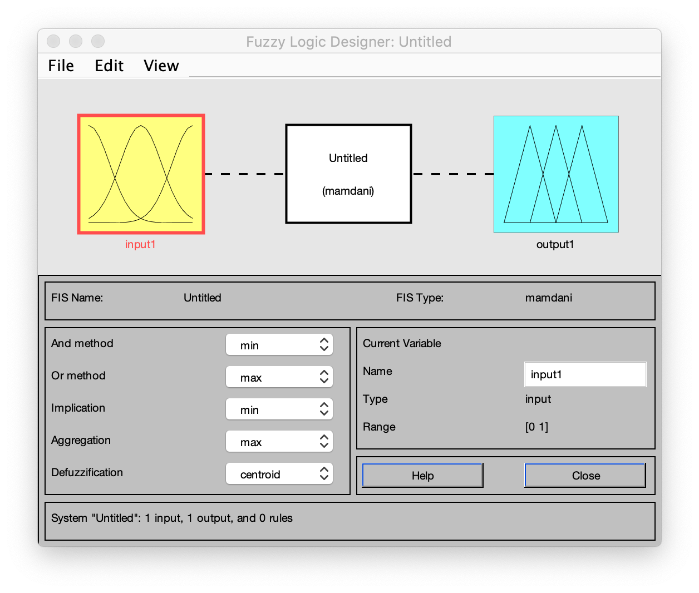
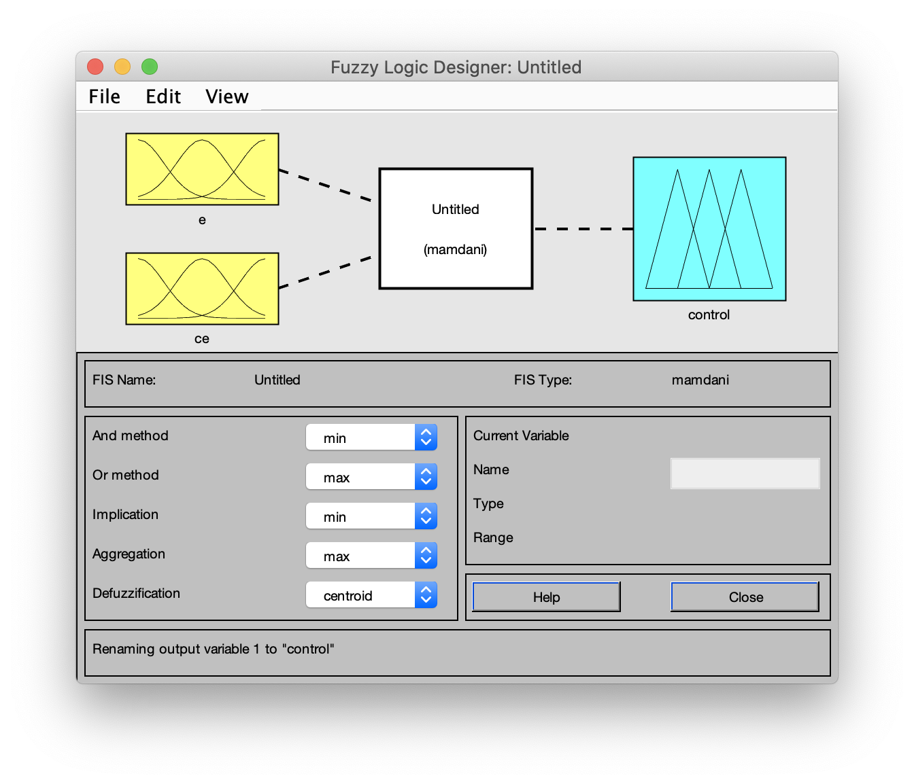
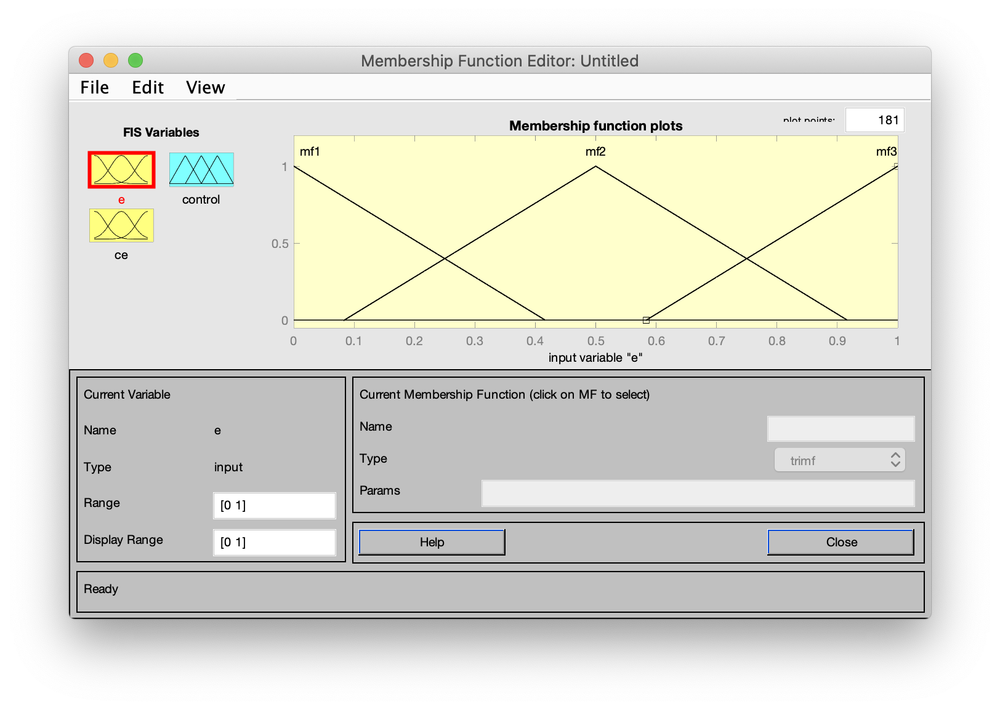
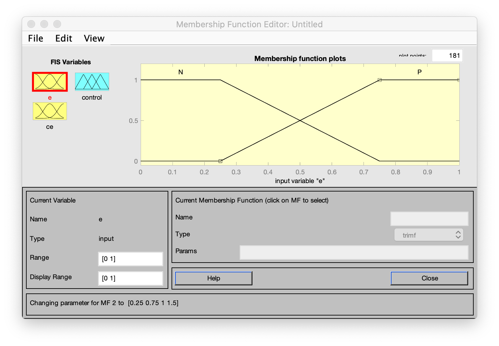
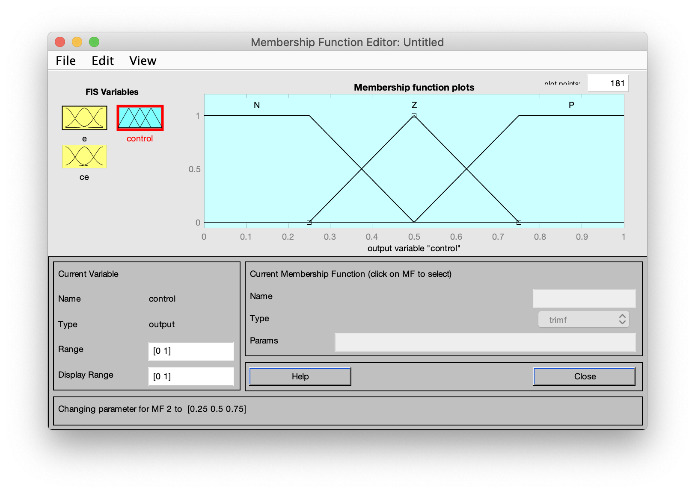
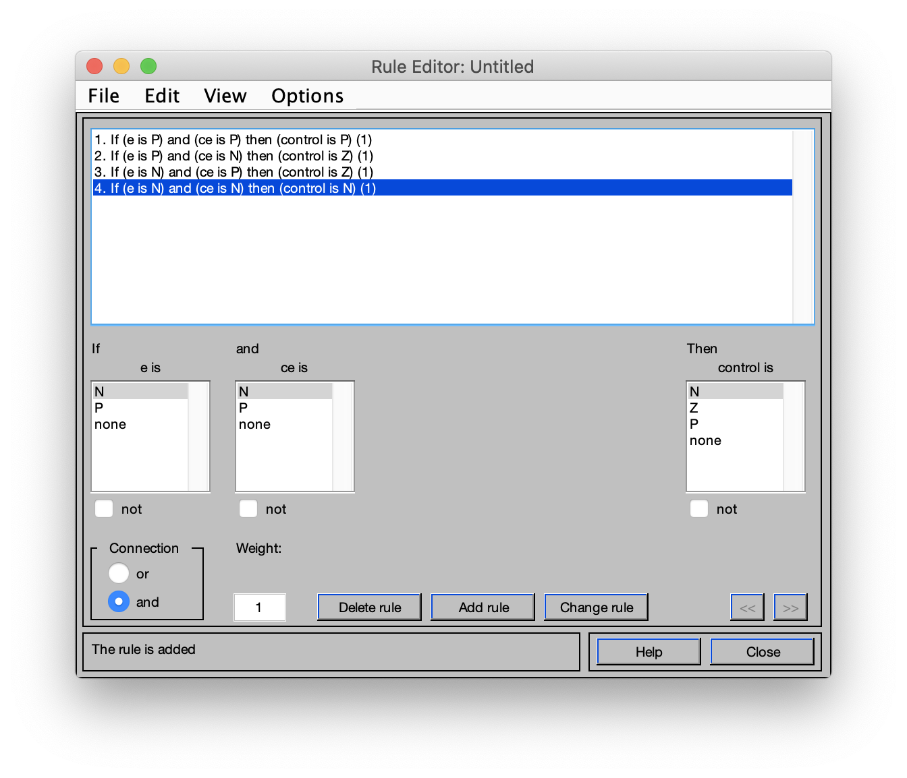
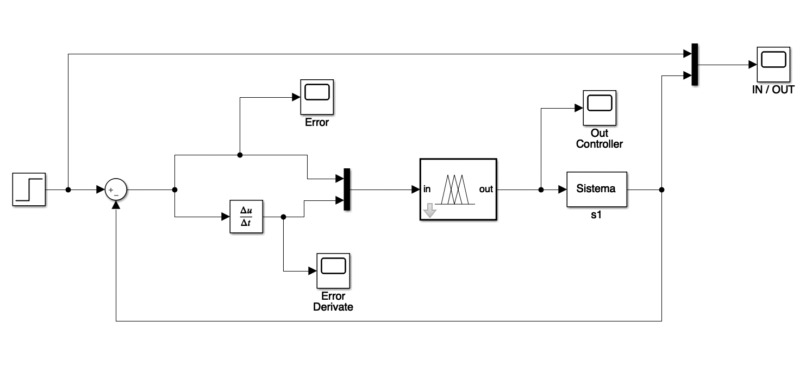
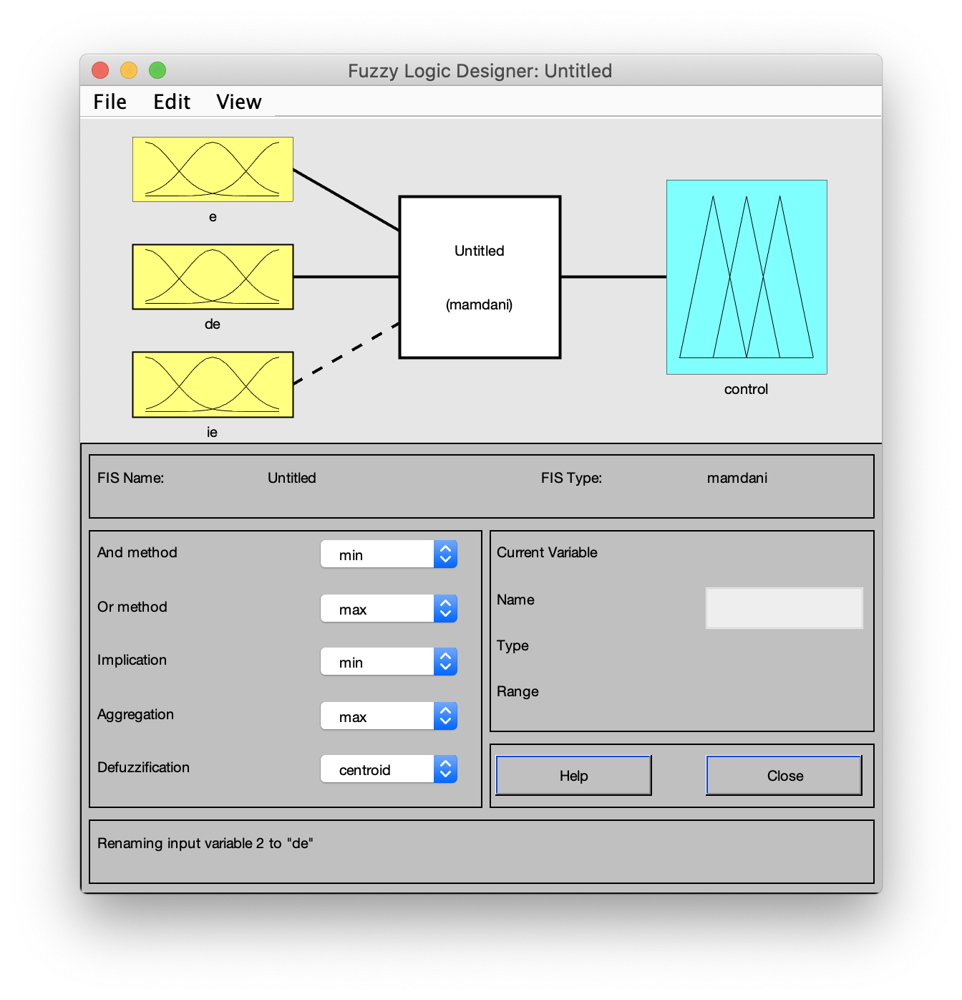
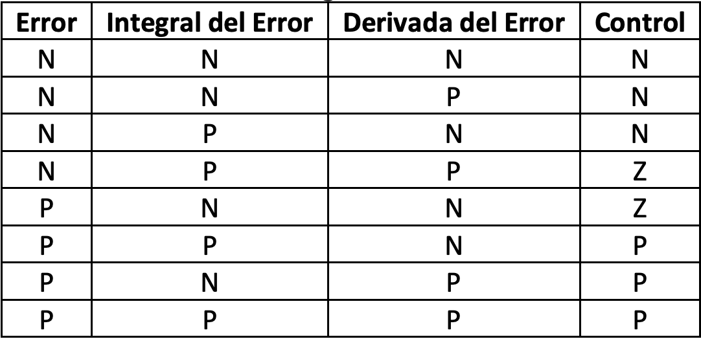
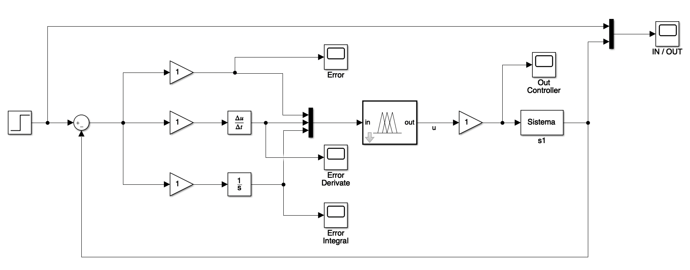

# Practica 4. Control Fuzzy.

El presente fichero es para indicar los pasos a seguir para realizar la práctica.

## Control PD Fuzzy.
---

Para realizar la el control fuzzy borroso se deben seguir los siguientes pasos:

1. Crear el fichero pd_fuzzy.fis para el cual en la línea de comandos de MATLAB se debe escribir el comando `fuzzy` el cual mostrará la siguiente ventana:

En esta ventana podremos crear las entradas necesarias para construir nuestro fichero `.fis`.

2. Para el caso del control PD vamos a necesitar 2 entradas por tanto agregaremos una haciendo clic en `Edit -> Add variable -> Input`. Deberiamos tener ahora algo de la siguiente forma:

3. Ahora procedemos a hacer doble clic en uno de los recuadros amarillos para realizar modificaciones sobre las variables de los inputs. Esta accion abrirá una ventana como esta:

4. En la ventana abierta en el paso anterior vamos a eliminar una de las variables, a ponerlas como `trapmf` y a proceder a dejarlas de la siguiente forma:

    * Inputs: 

    

    * Output:

    

5. Una vez configurado esto, cerramos la ventana y hacemos clic en `Edit -> Rules` para generar las reglas del controlador fuzzy.

6. Cerramos la ventana anterior luego de definir las reglas y procedemos a exportar las reglas a un fichero `.fis` haciendo clic en `File -> Export -> To File...`.

7. Creamos el siguiente modelo en simulink:

8. Dentro del `Fuzzy Logic Controller` en el input de `FIS name:` debemos colocar el nombre de nuestro fichero `.fis` recien generado.

## Control PID Fuzzy.
---

Para realizar este controlador realizamos lo mismo que en el anterior pero en el editor del controplador fuzzy creamos una tercera variable para la acción integral, tal y como se muestra a continuación:

Las reglas a colocar en el controlador pueden ser:

Y el modelo a generar con simulink es el siguiente:

