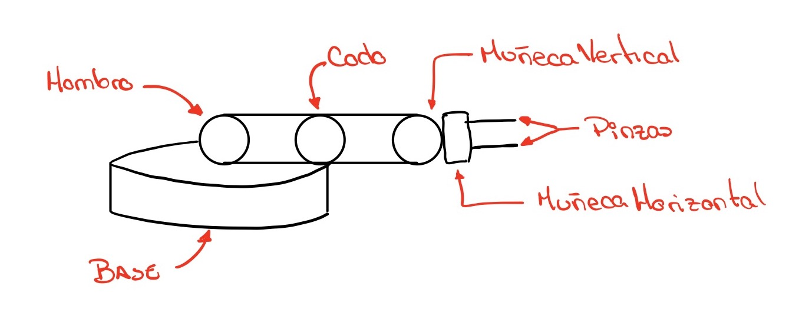

# Paso a paso por la práctica

## Autor:
Frederick Ernesto Borges Noronha &nbsp; [](https://github.com/FrederickBor)

## Esquema de las articulaciones del brazo robot

<p aling="center">
    
</p>

## Paso 1. Generar los datos.

En la línea de commandos del MATLAB ejecutar:

```MATLAB
brazo
```
Esto abrirá la siguiente ventana, donde podremos generar los datos para entrenar la red:

<p aling="center">
    
</p>

Ahora debemos llevar el brazo robot a la posición indicada en la práctica para lo cual presionaremos:

1. **Levantar el hombro 45º:** Presionar 45 veces la tecla `UP`

2. **Cambiar el selector para mover el codo:** Presionar la tecla `RE PAG`

3. **Bajar el codo hasta que este en posición horizontal:** Presionar 45 veces la tecla `DOWN`

4. **Cambiar el selector para mover el codo:** Presionar la tecla `RE PAG`

5. **Rotar la muñeca vertical 45º hacia abajo:** Presionar 45 veces la tecla `DOWN`

6. **Girar sobre la base 90º:** Presionar 90 veces la tecla `LEFT`

Luego de seguir estos pasos el brazo debería estar como en la siguiente figura:

<p aling="center">
    
</p>

Ahora procedemos a guardar los datos haciendo clic en `datos -> guardar datos` y luego los exportamos al workspace haciendo clic en `datos -> exportar datos al workspace`.

## Paso 2. Crear la red.

### Esquema de la red a crear.

<p aling="center">
    
</p>

Para crear la red mostrada anteriormente hay que seguir los siguientes pasos:

1. En los datos exportados se tiene una túpla (X,Y,Z) en `datos.efector`. Una vez dicho esto ejecutamos el siguiente código para obtener los datos de entrada:

```MATLAB
input = datos.efector
% Tomamos los valores finales
u = input(361,1)
v = input(361,2)
w = input(361,3)
% Creamos 3 columnas con los valores anteriores
u_column = ones(360,1) * u
v_column = ones(360,1) * v
w_column = ones(360,1) * w
input(361,:) = [] % Eliminamos la última fila
input = [input u_column v_column w_column]
input = input.' % Transponemos la matriz
```

2. En `datos.angulo` se tienen las salidas obtenidas por cada uno de los movimientos según la siguiente tabla:

|Base|Hombro|Codo|Muñeca Vertical|
|:---:|:----:|:--:|:-------------:|
|0|0|0|0|

Sabiendo esto, procedemos a crear las variables de salida de la siguiente manera:

```MATLAB
output_base = datos.angulo(:,1,:).'
output_hombro = datos.angulo(:,2,:).'
output_codo = datos.angulo(:,3,:).'
output_muneca = datos.angulo(:,4,:).'
```

3. Antes de ir a la herramienta `nntool` vamos a expandir nuestros vectores de entrada y salida para obtener mejores resultados y para eso utilizamos el siguiente codigo:

```MATLAB
input = [input input input input]
output_base = [output_base output_base output_base output_base]
output_hombro = [output_hombro output_hombro output_hombro output_hombro]
output_codo = [output_codo output_codo output_codo output_codo]
output_muneca = [output_muneca output_muneca output_muneca output_muneca]
```

4. Abrir la herramienta `nntool` ejecutando en la linea de comandos el siguiente comando:

```MATLAB
nntool
```

Ahora deberiamos tener abierta una ventana como esta:

<p aling="center">
    
</p>

5. Importamos los datos haciendo clic en `Import` y procedemos a importar la variable `input` como `Input Data`, las variables de output como `Target Data`, luego hacemos clic en `Close` y deberiamos ver ahora una pantalla como esta:

<p aling="center">
    
</p>

6. Hacemos clic en `New...` y procedemos a crear las redes `nn_base`, `nn_codo`, `nn_hombro`, `nn_muneca` de la siguiente manera:

Nota: se pueden poner entre 10 y 25 Neuronas. La base suele necesitar menos neuronas y la muñeca más.

### Ejemplo con `base_nn`

|Capa 1|Capa2|Capa3|
|:----:|:---:|:---:|
||||

Si hacemos clic en el boton view deberiamos tener algo similiar a:

<p aling="center">
    
</p>

Luego de hacer esto hacemos clic en `Create` y luego de haber creado las 4 redes hacemos clic en `Close`.

7. Ahora vamos a entrenar nuestras redes, hacemos doble clic en una red y se nos abrirá una ventana como esta:

<p aling="center">
    
</p>

Aquí haremos clic en la pestaña de train y ponemos el `Inputs` y el `Targets` segun la red que estemos entrenando:

<p aling="center">
    
</p>

Luego hacemos clic en `Train Network` y se nos abrirá una ventana con los resultados del entrenamiento:

<p aling="center">
    
</p>

Para este entrenamiento a mi me ha resultado en el siguiente `Performance`:

<p aling="center">
    
</p>

8. Ahora vamos a la pestaña de `View/Edit Weights` y guardamos los pesos haciendo clic en `Set Weights`.

<p aling="center">
    
</p>

9. Una vez hecho el entrenamiento y guardados los pesos para todas las redes procedemos a exportar dichas redes al workspace, deberiamos tener el siguiente resultado :

<p aling="center">
    
</p>

Hacemos clic en `Export...`  y seleccionamos las redes y luego hacemos clic en `Export`.

<p aling="center">
    
</p>

## Paso 3. Importar la red en el brazo robot

Para llevar a cabo este paso solo hace falta ejecutar el comando `brazo` y luego en la pestaña de `red` y luego `Importar redes` y allí importamos una a una cada una de las redes creadas.

<p aling="center">
    
</p>

## Paso 4. Probar el modelo

En la misma ventana del brazo robot luego de importar las redes hacemos clic en `Moviento Automatico` y nos pedirá la posición incial y final.

<p aling="center">
    
</p>

Al hacer clic en ok deberiamos tener el siguiente resultado:

<p aling="center">
    
</p>
